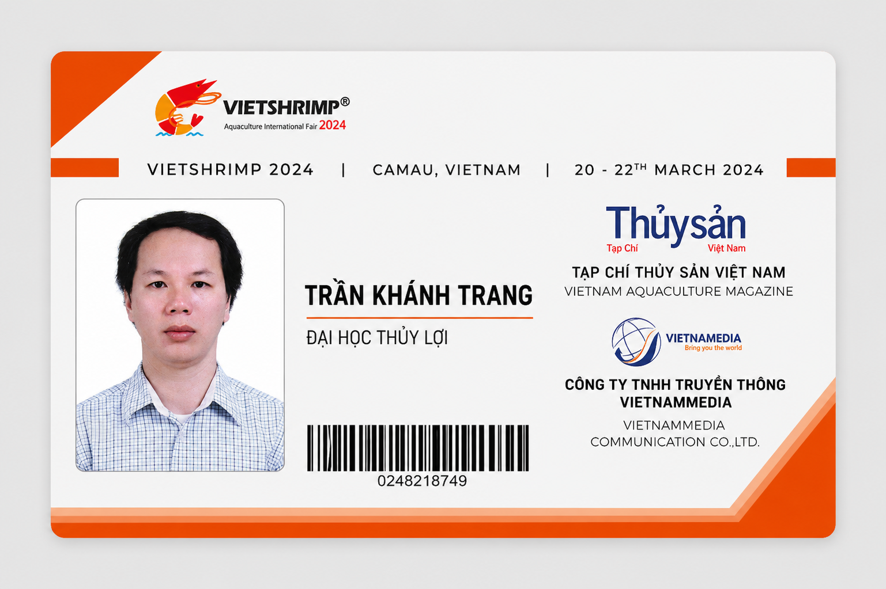

# Research Publications

This repository contains academic publications, research reports, and thesis works authored by Khanh Trang Tran.

---

# Master's Thesis in Economic Management

## Title
Research on the Shrimp Production Value Chain under Climate Change Adaptation in the Mekong Delta

## Research Background

This research was developed in the context of climate adaptation challenges affecting aquaculture and shrimp production systems in the Mekong Delta, Vietnam.

### Professional & Academic Engagement

Participation in aquaculture and climate-related professional events contributed to the practical understanding of industry challenges and sustainability issues.

  

## Description

This research investigates the shrimp production value chain in the Mekong Delta under the impacts of climate change and environmental uncertainty.

The study focuses on:
- Climate change adaptation
- Sustainable aquaculture development
- Economic resilience
- Value chain analysis
- Environmental and socio-economic impacts

---

## Author
Khanh Trang Tran

## Institution
Thuyloi University, Vietnam

## Research Profile
- ORCID: https://orcid.org/0009-0006-8563-2200
- GitHub: https://github.com/tran-khanhtrang

---

More publications and ongoing research projects will be added in the future.
