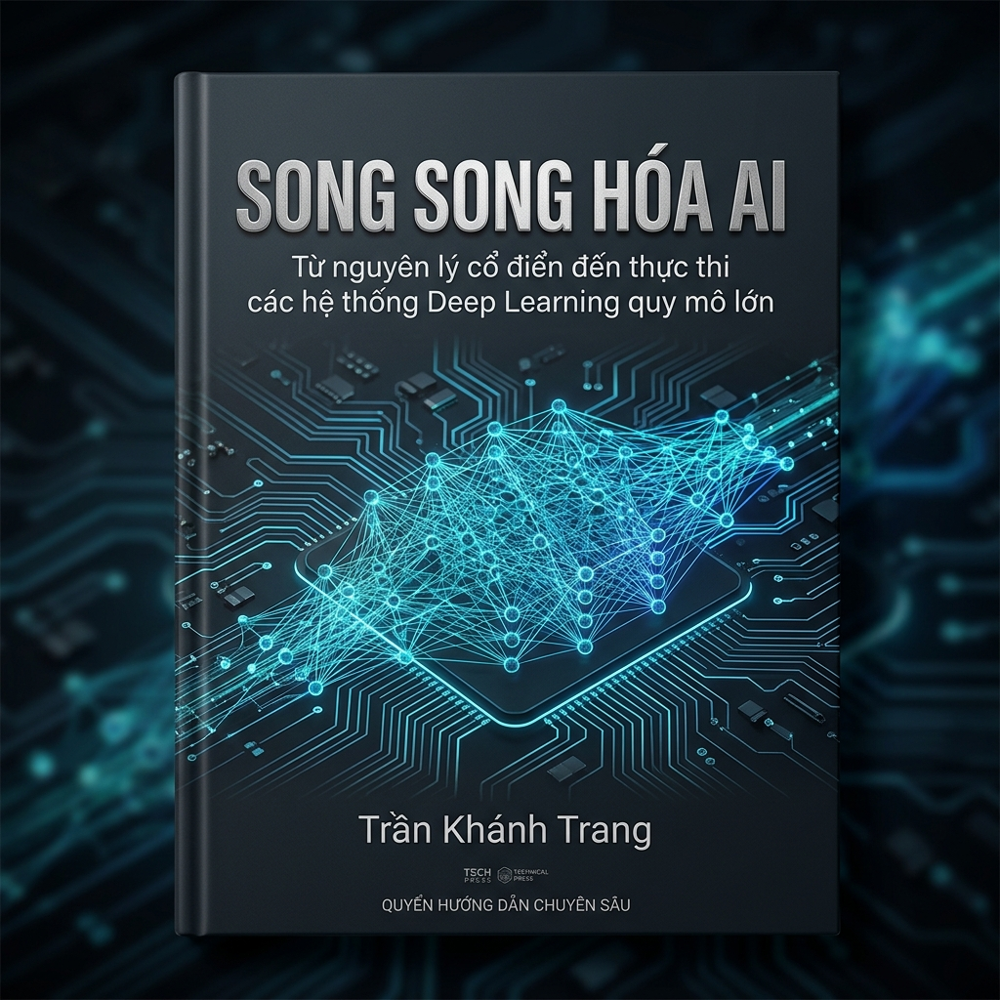

# Research Publications

This repository contains academic publications, technical reports, research papers, and thesis works authored by Khanh Trang Tran, focusing on Artificial Intelligence, Parallel Computing, Distributed Systems, Climate Adaptation, and Applied Research.

---

## Publications

- [AI Parallel Computing & AI-PCAM (2026)](papers/AI-Parallel-Computing-AI-PCAM-TranKhanhTrang.pdf)
- [Master's Thesis in Economic Management (2024)](papers/Economic-management-thesis-2024-TranKhanhTrang.pdf)

---

# Master's Thesis in Economic Management (2024)

## Research Title
*Research on the Shrimp Production Value Chain under Climate Change Adaptation in the Mekong Delta*

## Research Background

This research was conducted in the context of climate adaptation challenges affecting aquaculture and shrimp production systems in the Mekong Delta, Vietnam.

The Mekong Delta plays a critical role in Vietnam’s aquaculture economy, particularly in shrimp production and export activities. However, increasing climate variability, salinity intrusion, environmental degradation, and socio-economic uncertainties have significantly impacted the sustainability and resilience of the shrimp value chain.

This study aims to analyze the structure, vulnerabilities, and adaptive capacity of the shrimp production value chain under climate change conditions, while proposing sustainable development orientations for the future.

**Keywords:** Climate Change Adaptation, Aquaculture, Shrimp Value Chain, Mekong Delta, Sustainability, Economic Resilience

---

## Professional & Academic Engagement

Participation in aquaculture and climate-related professional events contributed to a practical understanding of industry challenges, sustainability issues, and stakeholder perspectives within the shrimp production ecosystem.

<p align="center">
  
</p>

---

## Description

This research investigates the shrimp production value chain in the Mekong Delta under the impacts of climate change and environmental uncertainty.

The study focuses on:

- Climate change adaptation strategies
- Sustainable aquaculture development
- Economic resilience of local production systems
- Shrimp value chain analysis
- Environmental and socio-economic impacts
- Sustainability and long-term adaptation capacity

The thesis combines theoretical analysis, industry observations, and practical perspectives related to climate adaptation and aquaculture sustainability in Vietnam.

---

# AI Parallel Computing & AI-PCAM (2026)

<p align="center">
  
</p>

## Research Title
*AI Parallel Computing: From Classical Principles to Large-Scale Deep Learning Systems*

## Research Background

The rapid development of modern Artificial Intelligence, particularly Large Language Models (LLMs) and Transformer-based architectures, has fundamentally transformed computational requirements in AI systems.

This publication explores the intersection of:

- Parallel Computing
- Distributed AI Systems
- GPU Architecture
- Tensor Computation
- High Performance Computing (HPC)
- Deep Learning Infrastructure

The work introduces the concept of **AI-PCAM**, an analytical framework extending classical PCAM methodology toward modern AI-oriented distributed computing environments.

**Keywords:** Parallel Computing, Distributed AI, GPU Systems, Tensor Parallelism, AI-PCAM, HPC, Deep Learning

---

## Description

This publication analyzes the computational foundations of modern AI systems and examines major parallelization strategies used in large-scale AI training.

Topics include:

- Data Parallelism
- Model Parallelism
- Tensor Parallelism
- Pipeline Parallelism
- Gradient Synchronization
- GPU Memory Hierarchy
- Communication vs Compute Trade-offs
- Distributed Training Architectures
- AI-PCAM Analytical Framework

The publication bridges concepts from traditional HPC and modern AI system engineering, providing both theoretical insights and practical implementation perspectives.

---

## Current Research Directions

- Distributed AI Systems
- Physics-Informed Deep Learning
- Hydrological Forecasting
- AI for Climate Adaptation
- GPU Parallel Computing
- Digital Twin Systems
- High Performance Computing (HPC)
- Applied Machine Learning

---

## Author

Khanh Trang Tran

## Institution

Thuyloi University, Vietnam

---

## Research Profiles

- ORCID: https://orcid.org/0009-0006-8563-2200
- GitHub: https://github.com/tran-khanhtrang

---

## Citation

### AI Parallel Computing & AI-PCAM (2026)

```bibtex
@misc{tran2026aipcam,
  author       = {Khanh Trang Tran},
  title        = {AI Parallel Computing: From Classical Principles to Large-Scale Deep Learning Systems},
  year         = {2026},
  publisher    = {GitHub Research Publications Repository},
  url          = {https://github.com/tran-khanhtrang/research-publications}
}
